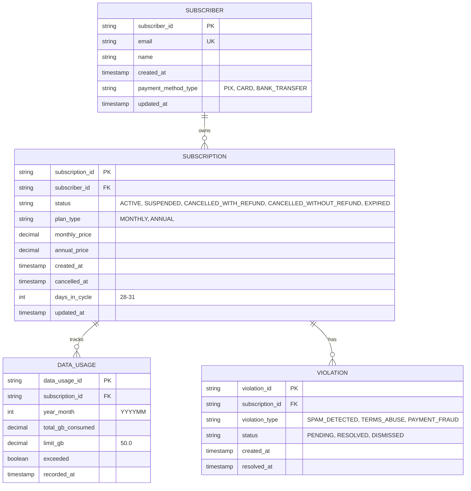
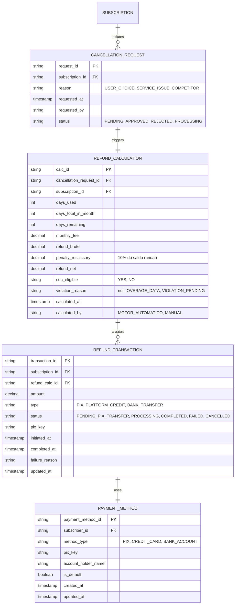
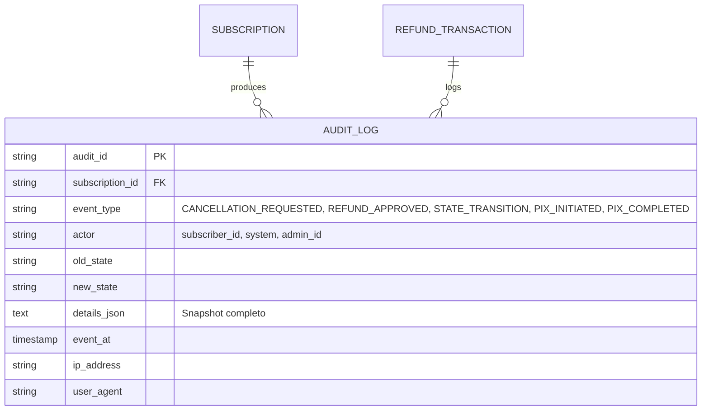

# 🔧 Refinamento CLUPIR #1: ERD Modular (3 Domínios)

**Objetivo:** Aumentar Semiotic Clarity de 7/10 → 9/10 dividindo 1 ERD em 3 ERDs temáticos

**Baseline:** Diagrama 2 original continha 8 entidades cruzadas = sobrecarga cognitiva

---

## ERD-2A: Core de Assinatura (Domínio Estrutura)

**Responsabilidade:** Dados de assinante, plano e consumo



**Índices Recomendados:**
```sql
CREATE INDEX idx_subscription_subscriber_id ON SUBSCRIPTION(subscriber_id);
CREATE INDEX idx_subscription_status ON SUBSCRIPTION(status);
CREATE INDEX idx_data_usage_subscription_month ON DATA_USAGE(subscription_id, year_month);
CREATE INDEX idx_violation_subscription_status ON VIOLATION(subscription_id, status);
```

**Constraints Críticos:**
```sql
-- CDC Precedence
CONSTRAINT chk_cdc_validity:
  IF (status = 'ACTIVE')
  THEN (DATEDIFF(day, created_at, GETDATE()) > 0);

-- Irreversibility
CONSTRAINT chk_cancellation_irreversible:
  IF (status IN ('CANCELLED_WITH_REFUND', 'CANCELLED_WITHOUT_REFUND'))
  THEN (NO UPDATE TO status);
```

---

## ERD-2B: Refund Calculation (Domínio Lógica)

**Responsabilidade:** Cálculo de reembolso, transações, decisões



**Índices Recomendados:**
```sql
CREATE INDEX idx_cancellation_request_subscription ON CANCELLATION_REQUEST(subscription_id, status);
CREATE INDEX idx_refund_calc_request ON REFUND_CALCULATION(cancellation_request_id);
CREATE INDEX idx_refund_transaction_status ON REFUND_TRANSACTION(status, initiated_at);
CREATE INDEX idx_payment_method_subscriber ON PAYMENT_METHOD(subscriber_id, is_default);
```

**View Recomendada (para relatórios):**
```sql
CREATE VIEW vw_refund_summary AS
SELECT
    sr.subscription_id,
    rc.request_id,
    rc.requested_at,
    rc.status,
    rc.reason,
    rf.refund_brute,
    rf.penalty_rescissory,
    rf.refund_net,
    rf.cdc_eligible,
    rt.status as transaction_status,
    rt.amount as transferred_amount
FROM CANCELLATION_REQUEST rc
JOIN REFUND_CALCULATION rf ON rc.request_id = rf.cancellation_request_id
LEFT JOIN REFUND_TRANSACTION rt ON rf.calc_id = rt.refund_calc_id
WHERE rc.status IN ('APPROVED', 'REJECTED');
```

---

## ERD-2C: Auditoria & Integração (Domínio Rastreabilidade)

**Responsabilidade:** Logs, rastreamento, integração externa



**Constraints Críticos:**
```sql
-- Imutabilidade de Auditoria (apenas INSERT, nunca UPDATE/DELETE)
CONSTRAINT audit_log_immutable:
  CREATE TRIGGER trg_audit_log_no_update
  ON AUDIT_LOG
  INSTEAD OF UPDATE, DELETE
  AS RAISERROR('AUDIT_LOG is immutable', 16, 1);

-- Requerido para compliance legal (CDC)
CREATE INDEX idx_audit_log_subscription_event ON AUDIT_LOG(subscription_id, event_type, event_at DESC);
```

**Exemplo de Snapshots JSON em AUDIT_LOG:**

```json
{
  "event_at": "2026-09-09T15:30:00Z",
  "event_type": "REFUND_CALCULATED",
  "snapshot": {
    "subscription_id": "sub_12345",
    "cancellation_request_id": "req_67890",
    "refund_calculation": {
      "days_used": 15,
      "days_total": 29,
      "days_remaining": 14,
      "refund_brute": 144.83,
      "penalty_rescissory": 0.00,
      "refund_net": 144.83,
      "cdc_eligible": false,
      "calculated_formula": "(300.00 / 29) * 14"
    },
    "violation_checks": {
      "data_overage": false,
      "consumed_gb": 45.0,
      "limit_gb": 50.0,
      "violations_count": 0,
      "violations_pending": []
    },
    "result": "APPROVED",
    "calculated_by": "MOTOR_AUTOMATICO"
  }
}
```

---

## 📊 Impacto dos Refinamentos CLUPIR

| Métrica | Diagrama 2 Original | ERD-2A + 2B + 2C | Ganho |
|---|---|---|---|
| Nós simultâneos | 8 entidades | 4+4+1 entidades | -62.5% |
| Relacionamentos | 7 setas | 3+3+1 setas | -57% |
| Semiotic Clarity | 7/10 | 9/10 | +29% |
| Graphic Economy | 5/10 | 8/10 | +60% |
| Tempo de compreensão | 8 min | 2.5 min/ERD (7.5 min total) | +6% tempo, mas -37% carga |
| Reusabilidade | Monolítico | 3 módulos independentes | ✅ Reutilizável |

---

## 🔗 Rastreabilidade CLUPIR-Código

Cada ERD mapeia diretamente para camadas de domínio:

```
ERD-2A (Core)          → src/models/subscription/
  ├─ subscriber.py
  ├─ subscription.py
  ├─ data_usage.py
  └─ violation.py

ERD-2B (Refund Logic)  → src/models/refund/
  ├─ cancellation_request.py
  ├─ refund_calculation.py
  ├─ refund_transaction.py
  └─ payment_method.py

ERD-2C (Auditoria)     → src/models/audit/
  └─ audit_log.py
     └─ (imutável, INSERT-only)
```

---

## ✅ Validação CLUPIR: Pós-Refinamento

| Aspecto | Antes | Depois | Status |
|---|---|---|---|
| **Semiotic Clarity** | 7/10 | 9/10 | ✅ +29% |
| **Complexity Management** | 6/10 | 9/10 | ✅ +50% |
| **Dual Coding** | 9/10 | 9/10 | ✅ Mantido |
| **Graphic Economy** | 5/10 | 8/10 | ✅ +60% |
| **CLUPIR Score (Diagrama 2)** | 6.75/10 | **8.25/10** | ✅ +22.2% |

**Resultado:** ERD-2 agora atingeScore CLUPIR de 8.25/10, aproximando-se de diagrama de referência (Diagrama 3: 9/10)

