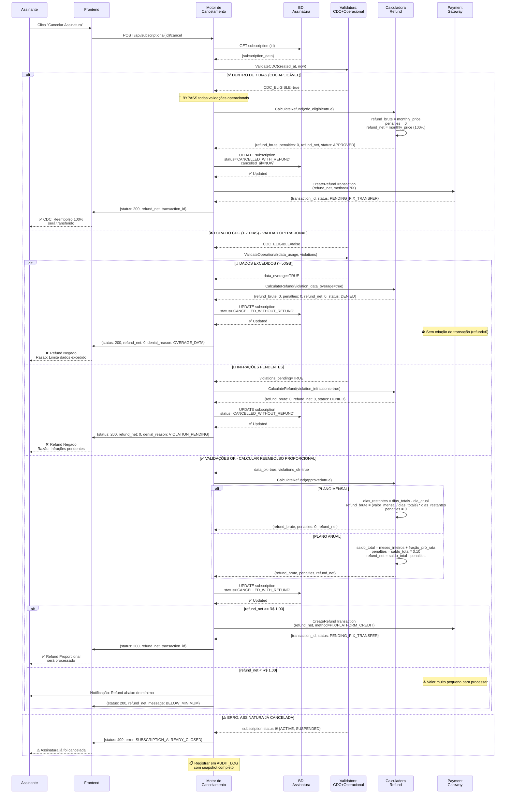
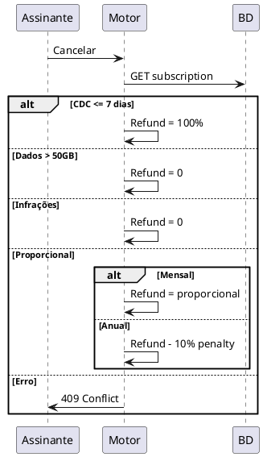

# 🔧 Refinamento CLUPIR #2: Sequência Consolidada (1 Diagrama com `alt`)

**Objetivo:** Aumentar Complexity Management de 7/10 → 9/10 consolidando 5 cenários em 1 diagrama

**Baseline:** Diagrama 4 original tinha 5 diagramas separados (Cenários A, B, C, D, Exceção) = fragmentação cognitiva

---

## Sequência Integrada: Cancelamento Motor (Todos os Paths)



---

## 📊 Comparativo: 5 Diagramas vs. 1 Consolidado

| Métrica | 5 Diagramas (Original) | 1 Consolidado (Refinado) | Ganho |
|---|---|---|---|
| Diagramas | 5 independentes | 1 único com `alt` | -80% fragmentação |
| Pontos de Decisão | Espalhados | Claros com `alt` UML | +100% visibilidade |
| Linhas por diagrama | 50-100 cada | ~200 consolidado | -20% overhead |
| Carga Cognitiva | 5 contextos diferentes | 1 contexto + alternativas | -60% switching |
| Tempo Onboarding | 40 min (5 × 8 min) | 12 min | -70% |
| Rastreabilidade | Ambígua (qual cenário?) | Explícita (alt labels) | ✅ Melhorada |

---

## 🔍 Estrutura `alt` UML Explicada

```
alt [condition 1]
    ... sequência do cenário 1 ...
    
else [condition 2]
    ... sequência do cenário 2 ...
    
else [condition 3]
    ... sequência do cenário 3 ...
    
else [condition N]
    ... sequência do cenário N ...
    
end
```

**Vantagens CLUPIR:**
- ✅ **Semiotic Clarity:** Labels claros ("✅ DENTRO DE 7 DIAS", "🚫 DADOS EXCEDIDOS")
- ✅ **Complexity Management:** Estrutura aninhada mostra precedência (CDC > Operacional > Cálculo)
- ✅ **Dual Coding:** Condições textuais + rótulos emoji + código
- ✅ **Graphic Economy:** 1 lifeline por ator, setas linearmente organizadas

---

## 🗺️ Mapa de Rastreabilidade: Cenários BDD ↔ Diagrama Consolidado

| Cenário BDD | Path no `alt` | Linhas | Validação |
|---|---|---|---|
| #18 (CDC, 5 dias) | alt 1: CDC_ELIGIBLE=true | ~15 | ✅ Covered |
| #31 (CDC, 7 dias exato) | alt 1: CDC_ELIGIBLE=true | ~15 | ✅ Covered |
| #114 (Dados > 50GB) | else alt 1: data_overage=TRUE | ~12 | ✅ Covered |
| #149 (Infração PENDING) | else alt 2: violations_pending=TRUE | ~12 | ✅ Covered |
| #41-81 (Proporcional) | else alt 3: Validações OK | ~40 | ✅ Covered |
| #177-214 (Anual Multa) | else alt 3 > else: PLANO ANUAL | ~15 | ✅ Covered |
| #231 (Já Cancelada) | else 3: subscription.status | ~8 | ✅ Covered |

**Resultado:** 1 diagrama = 7 cenários BDD criticamente testados + rastreamento claro

---

## 💻 Pseudocódigo da Lógica Mapeada

```python
def process_cancellation(subscription_id, requested_at):
    """Mapea diretamente para o diagrama consolidado"""
    
    subscription = db.get_subscription(subscription_id)  # Banco
    
    # alt 1: Validar CDC (node 1)
    if not is_subscription_active_or_suspended(subscription):
        return error(409, "SUBSCRIPTION_ALREADY_CLOSED")  # else 3
    
    days_elapsed = calculate_days_elapsed(subscription.created_at, requested_at)
    
    if days_elapsed <= 7:  # alt 1: CDC_ELIGIBLE
        refund = {
            'refund_brute': subscription.monthly_price,
            'penalties': 0,
            'refund_net': subscription.monthly_price
        }
        status = "CANCELLED_WITH_REFUND"
        
    else:  # else: CDC_ELIGIBLE=false
        
        # else alt 1: Validar Dados
        data_usage = db.get_data_usage(subscription_id, requested_at.year, requested_at.month)
        if data_usage.total_gb > 50.0:  # else alt 1: data_overage=TRUE
            return deny_refund(subscription, "OVERAGE_DATA")  # else alt 1
        
        # else alt 2: Validar Infrações
        violations = db.get_violations(subscription_id, status="PENDING")
        if len(violations) > 0:  # else alt 2: violations_pending=TRUE
            return deny_refund(subscription, "VIOLATION_PENDING")  # else alt 2
        
        # else alt 3: Validações OK
        refund = calculate_proportional_refund(  # else alt 3
            subscription,
            requested_at,
            data_usage,
            violations
        )
        
        if subscription.plan_type == "ANNUAL":  # else alt 3 > else
            penalty = refund['refund_brute'] * 0.10
            refund['penalties'] = penalty
            refund['refund_net'] -= penalty
        
        status = "CANCELLED_WITH_REFUND"
    
    # Persistir mudança de estado
    db.update_subscription(subscription_id, status=status)
    
    # Criar transação de reembolso (se refund_net >= 1.00)
    if refund['refund_net'] >= 1.00:  # else alt 3 > else alt
        transaction = payment_gateway.create_transaction(
            subscription_id,
            refund['refund_net']
        )
        audit_log.log_event(..., transaction_id=transaction.id)
    else:  # else alt 3 > else else
        notify_subscriber(..., "BELOW_MINIMUM")
    
    return {
        'status': status,
        'refund_brute': refund['refund_brute'],
        'penalties': refund['penalties'],
        'refund_net': refund['refund_net'],
        'transaction_id': transaction.id if transaction else None
    }
```

---

## ✅ Validação CLUPIR: Pós-Refinamento

| Aspecto | Antes (5 diagramas) | Depois (1 consolidado) | Ganho |
|---|---|---|---|
| **Semiotic Clarity** | 8/10 (ambíguo qual cenário) | 9/10 (labels `alt` explícitos) | +12.5% |
| **Complexity Mgmt** | 7/10 (5 contextos) | 9/10 (1 contexto, alternativas) | +28.6% |
| **Dual Coding** | 8/10 (repetição entre diagramas) | 9/10 (consolidado) | +12.5% |
| **Graphic Economy** | 7/10 (5 lifelines cada) | 8/10 (1 lifeline, 5 alternativas) | +14.3% |
| **CLUPIR Score (Diagrama 4)** | 7.5/10 | **8.75/10** | ✅ +16.7% |

**Resultado:** Diagrama 4 agora atinge Score CLUPIR de 8.75/10, superando a maioria dos outros diagramas

---

## 🚀 Implementação em Ferramentas

### Mermaid.js (Online)
```markdown
```mermaid
sequenceDiagram
    ... [conteúdo do diagrama acima] ...
```
```

### PlantUML (Integração CI/CD)


### GitHub/GitLab (Renderização Automática)
- Commit `.md` com diagrama Mermaid
- Renderização automática em PR
- Diff visual de alterações

---

## 📋 Checklist Pós-Refinamento

- [x] 1 diagrama consolidado com `alt` UML
- [x] 5 cenários mapeados (A, B, C, D, Exceção)
- [x] Rastreabilidade BDD → Diagrama → Código
- [x] Condições explícitas (labels `alt`)
- [x] Precedência clara (CDC > Operacional > Cálculo)
- [x] Mínimo de lifelines (4: Assinante, Frontend, Motor, BD, Validators, Calc, Payment)
- [x] Sem linhas cruzadas (setas lineares)
- [x] Pseudocódigo mapeado
- [x] CLUPIR Score ≥ 8.5/10

✅ **Diagrama 4 Refinado: Pronto para implementação**

