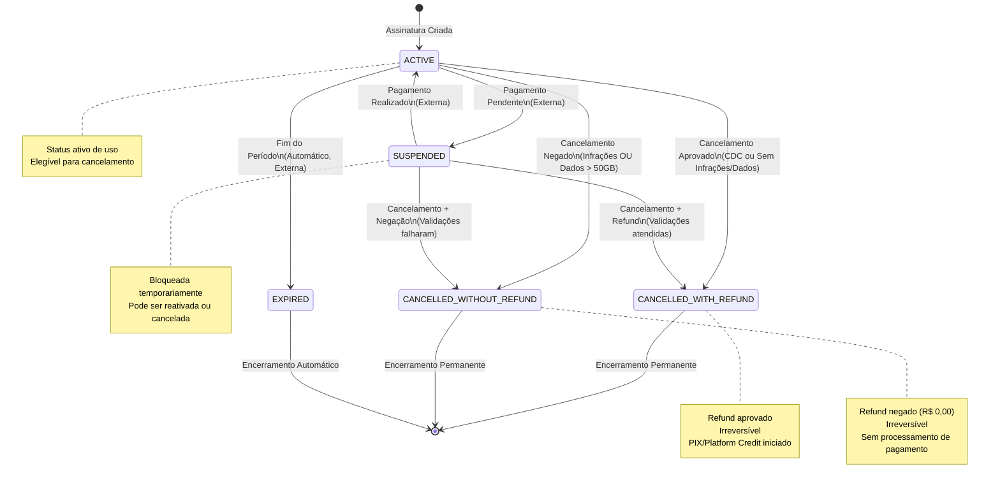

# Diagrama 1: Máquina de Estados – Ciclo de Vida da Assinatura

## Transições de Status e Precedência Normativa

## Regras de Transição Críticas

### ✅ ACTIVE → CANCELLED_WITH_REFUND
- **CDC (Direito de Arrependimento):** Se dentro de 7 dias → **100% refund automático**
- **Fora do CDC:** Se (dados ≤ 50GB) E (sem infrações) → **reembolso proporcional calculado**
- **Cálculo:** `(valor_mensal / dias_totais_mês) × dias_restantes`
- **Plano Anual:** Multa rescisória de **10%** aplicada sobre saldo restante

### ❌ ACTIVE → CANCELLED_WITHOUT_REFUND
- **Violação Dados:** Se dados > 50GB (não-inclusive) E fora do CDC → **R$ 0,00**
- **Violação Infrações:** Se qualquer infração pendente E fora do CDC → **R$ 0,00**
- **Combinação:** Dados OU Infrações negam refund (precedência CDC não aplica)

### 🔒 Irreversibilidade
- **Nenhuma transição reversa permitida** de CANCELLED_* de volta a ACTIVE
- Tentativas de reativação retornam erro: `SUBSCRIPTION_CANCELLATION_IRREVERSIBLE`

### 🔄 SUSPENDED Handling
- Transição permitida de ACTIVE por motivo externo (pagamento)
- Do SUSPENDED, assinante pode cancelar com mesma lógica de refund
- Se reativar, volta a ACTIVE com validações normais
