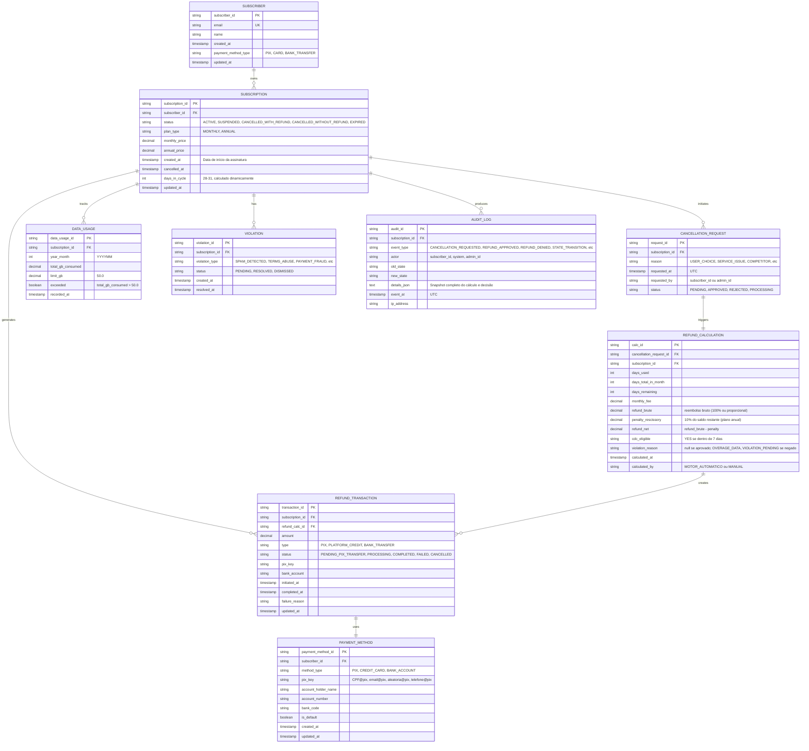

# Diagrama 2: Entidades e Relacionamentos (ERD)

## Modelo de Dados – Motor de Cancelamento SaaS



## Relacionamentos Críticos

### 1️⃣ **SUBSCRIPTION** ↔ **DATA_USAGE**
- 1 assinatura pode ter múltiplos registros de consumo (1 por mês)
- Campo `exceeded` é **booleano calculado** (total_gb_consumed > 50.0)
- Índice: `(subscription_id, year_month)`

### 2️⃣ **SUBSCRIPTION** ↔ **VIOLATION**
- 1 assinatura pode ter múltiplas violações pendentes
- Status `PENDING` é critério de negação de refund
- Qualquer `PENDING` implica refund = R$ 0,00 (fora do CDC)

### 3️⃣ **CANCELLATION_REQUEST** → **REFUND_CALCULATION**
- 1:1 Obrigatório (toda solicitação gera cálculo)
- Cálculo inclui **todas as variáveis** necessárias para auditoria
- `cdc_eligible` é determinístico: `datetime.now() - subscription.created_at ≤ 7 dias`

### 4️⃣ **REFUND_CALCULATION** → **REFUND_TRANSACTION**
- 1:1 se refund aprovado (refund_net > 0.01)
- 1:0 se refund negado (refund_net = 0.00) → não cria transação

### 5️⃣ **REFUND_TRANSACTION** ↔ **PAYMENT_METHOD**
- Múltiplas transações podem usar mesma payment_method
- Índice: `(subscriber_id, is_default=true)`

### 6️⃣ **AUDIT_LOG** (Rastreabilidade)
- **Requisito legal:** Todas as operações devem ser auditadas
- `details_json` = snapshot completo do cálculo (refund_brute, penalty, cdc_eligible, violation_reason)
- Garantir **imutabilidade** de audit_log (apenas INSERT, nunca UPDATE/DELETE)

## Constraints Críticos

```sql
-- CDC Precedence Constraint
CONSTRAINT chk_cdc_precedence:
  IF (days_since_creation <= 7 AND subscription.status IN ('ACTIVE', 'SUSPENDED'))
  THEN refund_calculation.refund_brute = subscription.monthly_price
  AND refund_calculation.penalty_rescissory = 0
  
-- Refund Denial Logic
CONSTRAINT chk_refund_denial:
  IF (days_since_creation > 7)
    AND (data_usage.total_gb_consumed > 50.0 OR violation.status = 'PENDING')
  THEN refund_calculation.refund_net = 0.00

-- Irreversibility
CONSTRAINT chk_irreversible_cancellation:
  IF subscription.status IN ('CANCELLED_WITH_REFUND', 'CANCELLED_WITHOUT_REFUND')
  THEN NO UPDATE TO status, NO transition back to ACTIVE

-- Decimal Precision
CONSTRAINT chk_decimal_precision:
  ALL monetary fields (price, refund, penalty) = DECIMAL(10,2)
  Rounding rule: ROUND_HALF_UP (banker's rounding)
```
