# Diagrama 3: Fluxo de Decisão – Algoritmo de Cancelamento

## Swimlanes: CDC vs. Refund Logic vs. Payment Pipeline

```mermaid
flowchart TD
    Start([Assinante solicita<br/>CANCELAMENTO]) --> GetDays["📅 Obter dias desde<br/>creation_at até NOW"]
    
    GetDays --> CDC_Check{⚖️ DENTRO DE 7 DIAS?<br/>CDC - Direito de<br/>Arrependimento}
    
    %% ========== CAMINHO 1: CDC (7 DIAS) ==========
    CDC_Check -->|SIM<br/>dias ≤ 7| CDC_Path["✅ CDC APLICÁVEL<br/>Precedência Normativa"]
    
    CDC_Path --> CDC_Refund["💰 Reembolso = 100%<br/>refund_brute = valor_mensal<br/>penalties = R$ 0,00"]
    CDC_Refund --> CDC_Status["🔄 Transição para<br/>CANCELLED_WITH_REFUND"]
    CDC_Status --> Audit_CDC["📋 Registrar em AUDIT_LOG<br/>event: CDC_APPLIED"]
    Audit_CDC --> CreateTx_CDC["💳 Criar REFUND_TRANSACTION"]
    CreateTx_CDC --> PaymentCDC["🏦 Processar Pagamento"]
    
    %% ========== CAMINHO 2: FORA DO CDC ==========
    CDC_Check -->|NÃO<br/>dias > 7| Post_CDC["⚠️ FORA DO PERÍODO CDC<br/>Aplicar validações operacionais"]
    
    Post_CDC --> CheckData["📊 Verificar Consumo<br/>de Dados"]
    CheckData --> DataOK{Dados ≤ 50GB?}
    
    %% --- VIOLAÇÃO: DADOS > 50GB ---
    DataOK -->|NÃO<br/>dados > 50GB| DataFail["❌ LIMITE EXCEDIDO<br/>(50GB+)"]
    DataFail --> DenyStatus["🔴 Transição para<br/>CANCELLED_WITHOUT_REFUND"]
    DenyStatus --> DenyAmount["💰 Refund = R$ 0,00<br/>Sem Multa"]
    DenyAmount --> Audit_Deny_Data["📋 AUDIT_LOG<br/>violation_reason: OVERAGE_DATA"]
    Audit_Deny_Data --> End_Deny_Data["⛔ FIM: Sem Processamento<br/>de Pagamento"]
    
    %% --- DADOS OK: VERIFICAR INFRAÇÕES ---
    DataOK -->|SIM<br/>dados ≤ 50GB| CheckViolation["🔍 Verificar INFRAÇÕES<br/>nos Termos de Uso"]
    CheckViolation --> ViolationOK{Alguma Infração<br/>PENDENTE?}
    
    %% --- VIOLAÇÃO: INFRAÇÕES PENDENTES ---
    ViolationOK -->|SIM<br/>violation_status<br/>=PENDING| ViolationFail["❌ INFRAÇÕES PENDENTES"]
    ViolationFail --> DenyStatus_Viol["🔴 Transição para<br/>CANCELLED_WITHOUT_REFUND"]
    DenyStatus_Viol --> DenyAmount_Viol["💰 Refund = R$ 0,00<br/>Sem Multa"]
    DenyAmount_Viol --> Audit_Deny_Viol["📋 AUDIT_LOG<br/>violation_reason: VIOLATION_PENDING"]
    Audit_Deny_Viol --> End_Deny_Viol["⛔ FIM: Sem Processamento<br/>de Pagamento"]
    
    %% --- APROVAÇÃO: CALCULAR REFUND PROPORCIONAL ---
    ViolationOK -->|NÃO<br/>Sem infrações| CalcRefund["✅ REFUND APROVADO<br/>Calcular Proporcional"]
    
    CalcRefund --> GetCycle["📅 Obter dias_totais<br/>do mês vigente<br/>calendar.monthrange()"]
    GetCycle --> CalcDays["🔢 dias_restantes =<br/>dias_totais - dia_atual"]
    CalcDays --> CalcAmount["💵 Calcular Reembolso<br/>bruto = (valor_mensal /<br/>dias_totais) × dias_restantes"]
    
    CalcAmount --> PlanType{Tipo de Plano?}
    
    %% --- PLANO MENSAL ---
    PlanType -->|MENSAL| Monthly["📅 Plano MENSAL<br/>Sem Multa Rescisória"]
    Monthly --> Monthly_Refund["💰 refund_net =<br/>refund_brute<br/>penalties = R$ 0,00"]
    Monthly_Refund --> Approve_Month["✅ Reembolso Aprovado"]
    
    %% --- PLANO ANUAL ---
    PlanType -->|ANUAL| Annual["📅 Plano ANUAL<br/>Aplicar Multa 10%"]
    Annual --> CalcRemaining["🔢 Calcular Saldo<br/>Restante = meses_inteiros<br/>+ fração_pró_rata"]
    CalcRemaining --> CalcPenalty["💰 penalty = saldo_restante<br/>× 0.10 (10%)"]
    CalcPenalty --> CalcNetAnnual["💰 refund_net =<br/>refund_brute - penalty"]
    CalcNetAnnual --> Approve_Annual["✅ Reembolso Aprovado"]
    
    %% --- CONVERGÊNCIA: PROCESSAMENTO DE PAGAMENTO ---
    Approve_Month --> Status_Approved["🔄 Transição para<br/>CANCELLED_WITH_REFUND"]
    Approve_Annual --> Status_Approved
    
    Status_Approved --> Audit_Approved["📋 AUDIT_LOG<br/>event: REFUND_APPROVED<br/>details_json = snapshot"]
    Audit_Approved --> CheckMinAmount{refund_net ≥<br/>R$ 1,00?}
    
    %% --- REFUND MÍNIMO NÃO ATINGIDO ---
    CheckMinAmount -->|NÃO<br/>< R$ 1,00| Notify_Min["📧 Notificar Assinante<br/>Refund muito pequeno<br/>para processar"]
    Notify_Min --> End_Min["✅ FIM: Cancelamento<br/>concluído (sem transação)"]
    
    %% --- REFUND OK: CRIAR TRANSAÇÃO ---
    CheckMinAmount -->|SIM<br/>≥ R$ 1,00| CreateTx["💳 Criar<br/>REFUND_TRANSACTION"]
    CreateTx --> ChooseMethod{Método de<br/>Reembolso?}
    
    %% --- MÉTODO: CRÉDITO NA PLATAFORMA ---
    ChooseMethod -->|PLATFORM_CREDIT| PlatformCredit["💼 Creditar Saldo<br/>na Plataforma<br/>status: COMPLETED"]
    PlatformCredit --> End_Platform["✅ FIM: Saldo disponível<br/>para futuras compras"]
    
    %% --- MÉTODO: PIX ---
    ChooseMethod -->|PIX| PixInit["🏦 PIX Transfer Initiated<br/>status: PENDING_PIX_TRANSFER"]
    PixInit --> PixProcess["⏳ Fila de Processamento<br/>PIX (STP)"]
    PixProcess --> PixConfirm{PIX Confirmado<br/>pelo Banco?}
    
    PixConfirm -->|SIM| PixComplete["✅ Transaction COMPLETED<br/>Notificar Assinante"]
    PixConfirm -->|NÃO| PixFail["❌ Transaction FAILED<br/>Registrar erro bancário"]
    
    PixComplete --> End_Pix["✅ FIM: Reembolso<br/>transferido"]
    PixFail --> End_PixFail["⚠️ FIM: Retry manual<br/>ou crédito em plataforma"]
    
    PaymentCDC --> End["🎯 PROCESSO CONCLUÍDO"]
    End_Deny_Data --> End
    End_Deny_Viol --> End
    End_Min --> End
    End_Platform --> End
    End_Pix --> End
    End_PixFail --> End
```



## Pontos Críticos de Decisão

| Ponto | Condição | Sim | Não | Precedência |
|-------|----------|-----|-----|-------------|
| **CDC** | `dias_desde_criação ≤ 7` | 100% refund + sem validações | Validações operacionais | ⚖️ Lei |
| **Dados** | `consumo_gb > 50.0` | Refund = R$ 0,00 | Próxima validação | ❌ Bloqueia |
| **Infrações** | `∃ violation.status = PENDING` | Refund = R$ 0,00 | Calcular refund | ❌ Bloqueia |
| **Refund ≥ R$ 1,00** | `refund_net ≥ 1.00` | Criar transação | Notificar + Fim | 💰 Operacional |
| **Método** | Assinante escolhe | PIX ou Platform Credit | N/A | 🏦 Integração |

## Regras de Negócio Codificadas

```python
# Pseudocódigo da lógica de decisão

def process_cancellation(subscription_id, requested_at):
    subscription = get_subscription(subscription_id)
    days_elapsed = (requested_at - subscription.created_at).days
    
    # 1. CDC Check (Precedência Normativa)
    if days_elapsed <= 7:
        refund_brute = subscription.monthly_price
        penalties = 0
        status = "CANCELLED_WITH_REFUND"
        # ✅ Bypass todas as validações
        create_refund_transaction(subscription_id, refund_brute, status)
        return status, refund_brute, 0, refund_brute
    
    # 2. Validações Operacionais (Fora do CDC)
    data_usage = get_data_usage(subscription_id, requested_at.year, requested_at.month)
    violations = get_violations(subscription_id, status="PENDING")
    
    if data_usage.total_gb > 50.0 or len(violations) > 0:
        # ❌ Refund Negado
        status = "CANCELLED_WITHOUT_REFUND"
        return status, 0, 0, 0
    
    # 3. Cálculo Proporcional (Aprovado)
    days_in_month = calendar.monthrange(requested_at.year, requested_at.month)[1]
    days_remaining = days_in_month - requested_at.day
    refund_brute = (subscription.monthly_price / days_in_month) * days_remaining
    
    # 4. Aplicar Multa Anual (se aplicável)
    if subscription.plan_type == "ANNUAL":
        remaining_balance = calculate_annual_remaining_balance(
            subscription, requested_at, days_remaining, days_in_month
        )
        penalties = remaining_balance * 0.10
    else:
        penalties = 0
    
    refund_net = refund_brute - penalties
    refund_net = max(refund_net, 0.00)  # Floor at 0
    
    # 5. Transação & Pagamento
    status = "CANCELLED_WITH_REFUND"
    
    if refund_net >= 1.00:
        create_refund_transaction(subscription_id, refund_net, status)
    else:
        notify_subscriber(subscription_id, "Refund too small for processing")
    
    return status, refund_brute, penalties, refund_net
```
