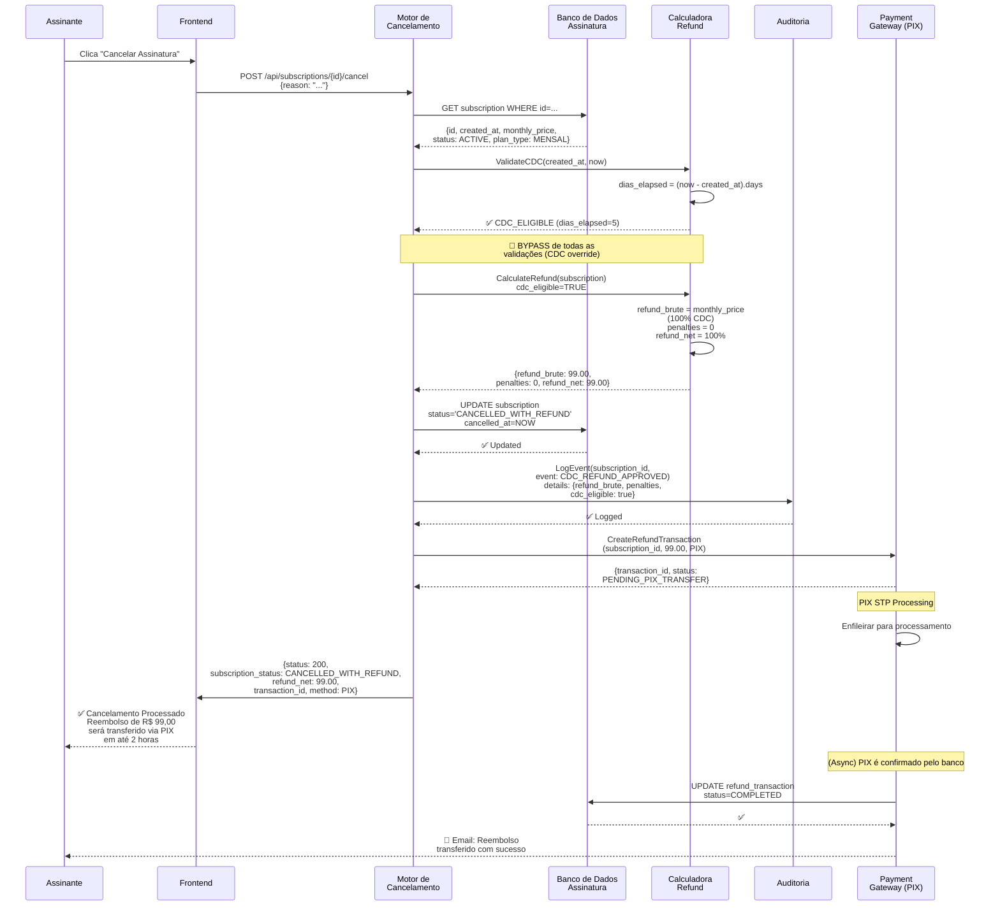
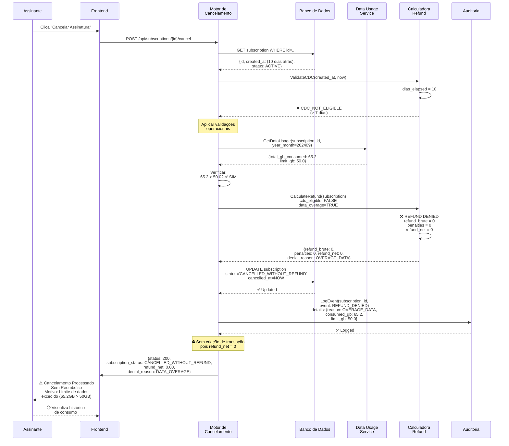
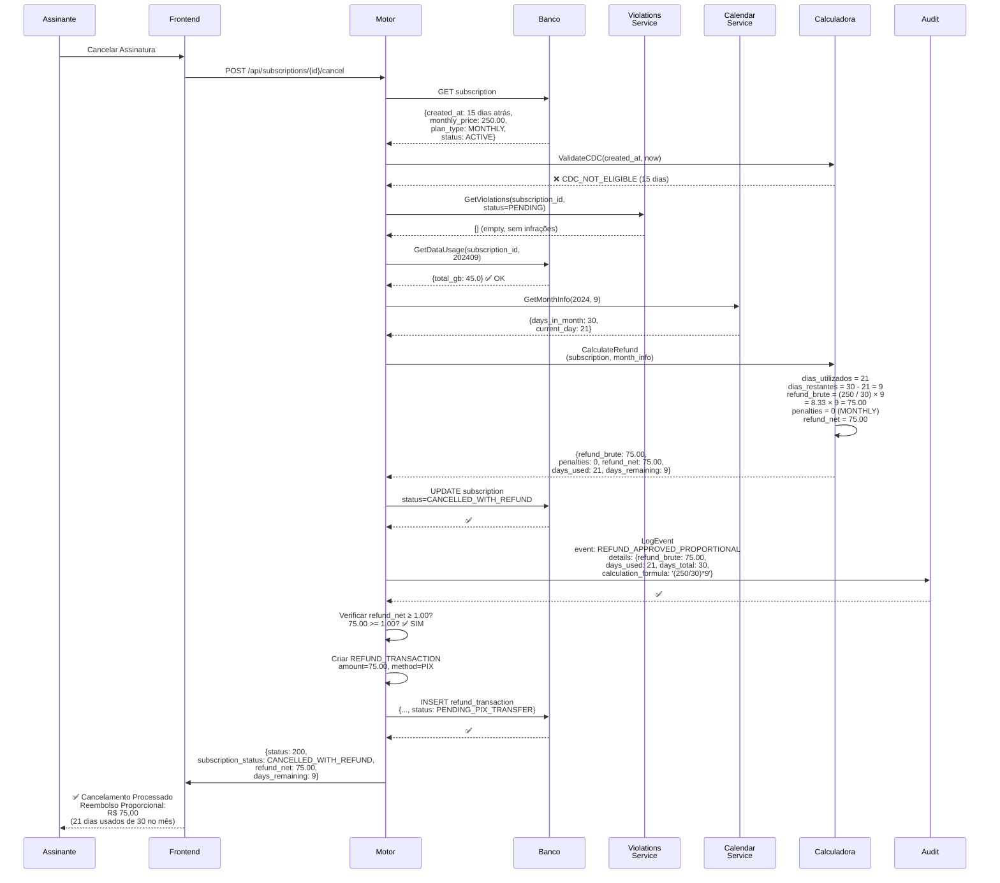
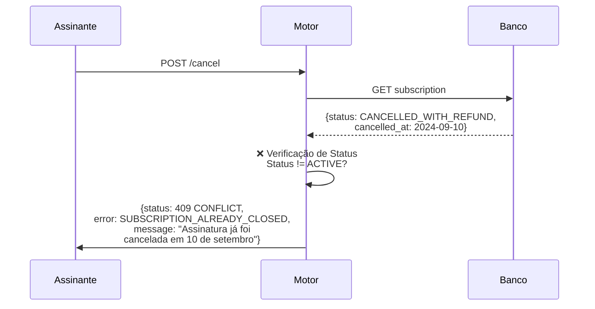

# Diagrama 4: Sequência – Cenários Críticos

## Cenário A: CDC (7 dias) – Reembolso 100% Imediato



---

## Cenário B: Pós-CDC com Dados Excedidos – Refund Negado



---

## Cenário C: Pós-CDC sem Violações – Reembolso Proporcional (Mensal)



---

## Cenário D: Plano ANUAL com Multa Rescisória

```mermaid
sequenceDiagram
    participant Assinante
    participant Motor
    participant Banco
    participant Calc as Calculadora
    participant Audit
    
    Assinante ->> Motor: Solicitar Cancelamento
    
    Motor ->> Banco: GET subscription<br/>plan_type=ANNUAL,<br/>annual_price=1200.00,<br/>created_at=01/mai/2024
    Banco -->> Motor: ✅
    
    Motor ->> Calc: ValidateCDC<br/>dias_elapsed = 120 (4 meses)
    Calc -->> Motor: ❌ CDC_NOT_ELIGIBLE
    
    Motor ->> Motor: Validações OK<br/>(sem infrações, dados OK)
    
    Motor ->> Calc: CalculateRefund<br/>(annual_subscription, requested_at=20/set/2024)
    
    Note over Calc: CÁLCULO ANUAL COMPLETO:<br/>1. Ciclo anual: mai/2024 - abr/2025<br/>2. Hoje: 20 de setembro (dentro do ciclo)<br/>3. Meses inteiros restantes:<br/>&nbsp;&nbsp; out(31), nov(30), dez(31),<br/>&nbsp;&nbsp; jan(31), fev(28), mar(31), abr(30)<br/>&nbsp;&nbsp; = 7 meses<br/>4. Fração pró-rata de setembro:<br/>&nbsp;&nbsp; dias_restantes = 30 - 20 = 10<br/>&nbsp;&nbsp; fração = (1200/12)/30 × 10<br/>&nbsp;&nbsp;&nbsp;&nbsp;&nbsp;&nbsp;&nbsp; = (100/30) × 10 = 33.33<br/>5. Saldo total restante:<br/>&nbsp;&nbsp; (100 × 7) + 33.33 = 733.33<br/>6. Multa rescisória 10%:<br/>&nbsp;&nbsp; penalty = 733.33 × 0.10 = 73.33<br/>7. Reembolso Líquido:<br/>&nbsp;&nbsp; refund_net = 733.33 - 73.33<br/>&nbsp;&nbsp;&nbsp;&nbsp;&nbsp;&nbsp;&nbsp; = 660.00
    
    Calc -->> Motor: {refund_brute: 733.33,<br/>penalties: 73.33,<br/>refund_net: 660.00,<br/>penalty_reason: ANNUAL_RESCISSORY_10_PERCENT}
    
    Motor ->> Banco: UPDATE subscription<br/>status=CANCELLED_WITH_REFUND
    Banco -->> Motor: ✅
    
    Motor ->> Audit: LogEvent<br/>details: {plan_type: ANNUAL,<br/>remaining_balance: 733.33,<br/>penalty_rate: 0.10,<br/>penalty_amount: 73.33}
    Audit -->> Motor: ✅
    
    Motor ->> Motor: Criar transação: 660.00
    
    Motor ->> Assinante: ✅ Cancelamento Processado<br/>Reembolso Líquido: R$ 660,00<br/>(-) Multa Rescisória 10%: R$ 73,33
```

---

## Fluxo de Exceção: Subscription Já Cancelada


