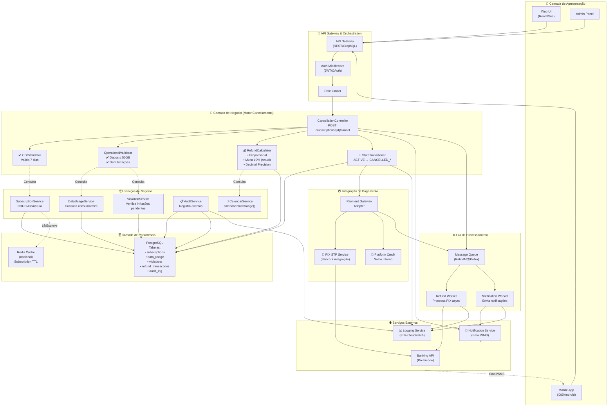

# Diagrama 5: Arquitetura de Componentes

## Camadas e Responsabilidades



---

## Padrões Arquiteturais Implementados

### 1️⃣ **Separation of Concerns (SoC)**
```
┌─────────────────────────────────────────────────────┐
│ Presentation (Web, Mobile, Admin)                   │
└────────────────────┬────────────────────────────────┘
                     ↓
┌─────────────────────────────────────────────────────┐
│ API Gateway & Middleware                            │
├─────────────────────────────────────────────────────┤
│ • Authentication/Authorization                      │
│ • Rate Limiting                                     │
│ • Request/Response Validation                       │
└────────────────────┬────────────────────────────────┘
                     ↓
┌─────────────────────────────────────────────────────┐
│ Business Logic (Motor Cancelamento)                 │
├─────────────────────────────────────────────────────┤
│ • CDCValidator                                      │
│ • OperationalValidator                              │
│ • RefundCalculator                                  │
│ • StateTransitioner                                 │
└────────────────────┬────────────────────────────────┘
                     ↓
┌─────────────────────────────────────────────────────┐
│ Services Layer (Data Access, External Integrations) │
├─────────────────────────────────────────────────────┤
│ • SubscriptionService                               │
│ • DataUsageService                                  │
│ • ViolationService                                  │
│ • AuditService                                      │
│ • PaymentGateway                                    │
└────────────────────┬────────────────────────────────┘
                     ↓
┌─────────────────────────────────────────────────────┐
│ Persistence (Database, Cache)                       │
└─────────────────────────────────────────────────────┘
```

### 2️⃣ **Strategy Pattern (Refund Calculation)**
```python
class RefundCalculator:
    def calculate(self, subscription, cdc_eligible, violations, data_overage):
        if cdc_eligible:
            return self._cdc_full_refund(subscription)
        
        if violations or data_overage:
            return self._refund_denied(subscription)
        
        if subscription.plan_type == "MONTHLY":
            return self._monthly_proportional(subscription)
        else:  # ANNUAL
            return self._annual_with_penalty(subscription)
    
    def _cdc_full_refund(self, subscription):
        return {refund_brute: subscription.monthly_price, penalties: 0}
    
    def _refund_denied(self, subscription):
        return {refund_brute: 0, penalties: 0}
    
    def _monthly_proportional(self, subscription):
        # Cálculo: (valor_mensal / dias_totais) × dias_restantes
        pass
    
    def _annual_with_penalty(self, subscription):
        # Cálculo: saldo_restante - (saldo_restante × 0.10)
        pass
```

### 3️⃣ **Chain of Responsibility (Validators)**
```
CancellationRequest
        ↓
    [CDCValidator]  ← Valida precedência normativa
        ↓ (CDC? → BYPASS resto)
    [OperationalValidator]  ← Valida Dados + Infrações
        ↓ (Violação? → DENY)
    [RefundCalculator]  ← Calcula valor
        ↓
    [StateTransitioner]  ← Aplica mudança de estado
        ↓
    [PaymentProcessor]  ← Processa reembolso
```

### 4️⃣ **Event Sourcing (Auditoria)**
```
Cada operação crítica gera um evento imutável:

Event: {
    type: "CANCELLATION_REQUESTED",
    subscription_id: "sub_123",
    timestamp: "2024-09-09T15:30:00Z",
    actor: "subscriber_id",
    details: {
        cdc_eligible: false,
        days_elapsed: 15,
        data_overage: true,
        violations_count: 0,
        refund_brute: 0,
        penalties: 0,
        refund_net: 0,
        denial_reason: "OVERAGE_DATA"
    }
}

Log (Imutável): INSERT INTO audit_log VALUES (...)
```

### 5️⃣ **Asynchronous Processing (Fila)**
```
Síncrono (Transação):
┌──────────────────────────┐
│ 1. Validar CDC           │
│ 2. Validar Operacional   │
│ 3. Calcular Refund       │
│ 4. Atualizar Subscription│
│ 5. Registrar Auditoria   │
└──────────────────────────┘
    ↓ (responde ao cliente)

Assíncrono (Fila):
┌──────────────────────────┐
│ 1. Processar PIX STP     │
│ 2. Enviar Notificações   │
│ 3. Logs/Observabilidade  │
└──────────────────────────┘
    (executa em background, sem bloquear cliente)
```

---

## Matriz de Responsabilidades (RACI)

| Componente | CDC | Operacional | Refund | Persist | Payment | Audit |
|---|---|---|---|---|---|---|
| **CDCValidator** | **R** | - | - | - | - | C |
| **OperationalValidator** | C | **R** | - | C | - | C |
| **RefundCalculator** | C | C | **R** | - | - | C |
| **StateTransitioner** | C | C | C | **R** | - | C |
| **PaymentGateway** | - | - | C | - | **R** | C |
| **AuditService** | I | I | I | I | I | **R** |

**R**=Responsible, **A**=Accountable, **C**=Consulted, **I**=Informed

---

## Definições de Interface (Contrato)

### Controller Request/Response

```typescript
// Request
POST /api/subscriptions/{subscription_id}/cancel
{
  reason: string,           // "USER_CHOICE", "SERVICE_ISSUE", etc
  refund_method: "PIX" | "PLATFORM_CREDIT",  // Assíncrono pode ser undefined
  pix_key?: string          // Optional para PIX
}

// Response (200 OK)
{
  status: "CANCELLED_WITH_REFUND" | "CANCELLED_WITHOUT_REFUND",
  refund_brute: number,     // Decimal(10,2)
  refund_net: number,       // Decimal(10,2)
  penalties: number,        // Decimal(10,2)
  days_used: number,
  days_remaining: number,
  violations: number,
  subscription_type: "MONTHLY" | "ANNUAL",
  transaction_id?: string,  // Se refund_net >= 1.00
  message: string
}

// Response (4xx/5xx Error)
{
  error: string,
  code: "SUBSCRIPTION_ALREADY_CLOSED" | "INVALID_REQUEST" | "SERVER_ERROR",
  message: string
}
```

---

## Deployment Topology

```
┌─────────────────────────────────────────────────┐
│         Load Balancer (ALB/Nginx)              │
└─────────────────────┬───────────────────────────┘
                      ↓
    ┌─────────────────────────────────────────┐
    │    Kubernetes Cluster (Prod)             │
    ├─────────────────────────────────────────┤
    │ Pod 1: CancellationMotor (Replicas: 3)  │
    │ • Container: app:v1.2.0                 │
    │ • CPU: 500m, Memory: 512Mi              │
    │                                         │
    │ Pod 2: RefundWorker (Replicas: 2)       │
    │ • Processa fila async                   │
    │                                         │
    │ Pod 3: PostgreSQL (StatefulSet)         │
    │ • Replica set (master/slave)            │
    │                                         │
    │ Pod 4: Redis (Cache)                    │
    │                                         │
    │ Pod 5: RabbitMQ (Message Queue)         │
    └─────────────────────────────────────────┘
                      ↓
    ┌─────────────────────────────────────────┐
    │     External Services                    │
    ├─────────────────────────────────────────┤
    │ • PIX STP (Banco X)                      │
    │ • Email Service (SendGrid)              │
    │ • Logging (ELK Stack)                   │
    └─────────────────────────────────────────┘
```
