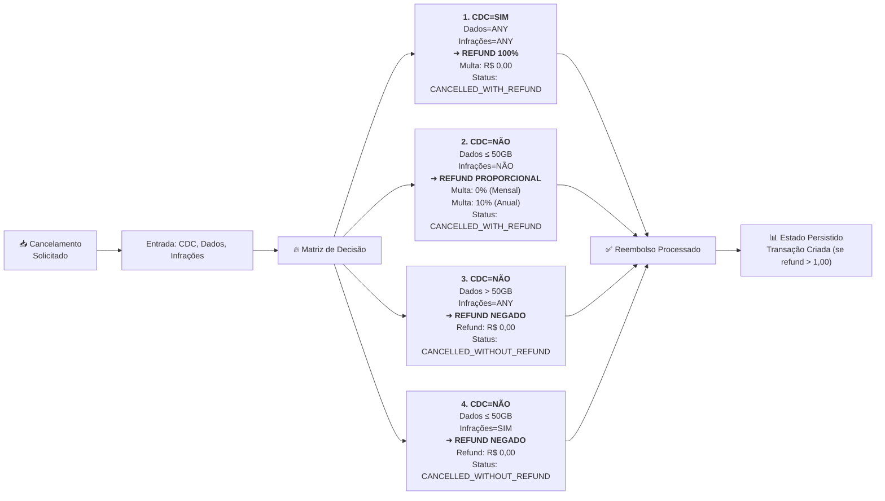

# Diagrama 6: Matriz de Decisão – Cobertura de Cenários BDD

## Heatmap de Combinações: CDC × Dados × Infrações → Resultado



---

## Tabela de Combinações Exaustiva

| # | CDC | Consumo GB | Infrações | Plano | Resultado | Refund Bruto | Penalty | Refund Net | Status | Testes |
|---|---|---|---|---|---|---|---|---|---|---|
| **1** | ✅ SIM (≤7d) | 75 | Sim | MENSAL | ✅ APROVADO | R$ 99,00 | R$ 0,00 | R$ 99,00 | CANCELLED_WITH_REFUND | BDD#18,19 |
| **2** | ✅ SIM (≤7d) | 30 | Não | MENSAL | ✅ APROVADO | R$ 99,00 | R$ 0,00 | R$ 99,00 | CANCELLED_WITH_REFUND | BDD#18 |
| **3** | ✅ SIM (7d exato) | 100 | Sim | MENSAL | ✅ APROVADO | R$ 199,00 | R$ 0,00 | R$ 199,00 | CANCELLED_WITH_REFUND | BDD#31 |
| **4** | ❌ NÃO (8d) | 45 | Não | MENSAL | ✅ PROPORCIONAL | R$ 66,00 | R$ 0,00 | R$ 66,00 | CANCELLED_WITH_REFUND | BDD#41,70-81 |
| **5** | ❌ NÃO (10d) | 65 | Não | MENSAL | ❌ NEGADO | R$ 0,00 | R$ 0,00 | R$ 0,00 | CANCELLED_WITHOUT_REFUND | BDD#114,118 |
| **6** | ❌ NÃO (10d) | 50 | Não | MENSAL | ✅ PROPORCIONAL | R$ 83,33 | R$ 0,00 | R$ 83,33 | CANCELLED_WITH_REFUND | BDD#127 |
| **7** | ❌ NÃO (10d) | 50.01 | Não | MENSAL | ❌ NEGADO | R$ 0,00 | R$ 0,00 | R$ 0,00 | CANCELLED_WITHOUT_REFUND | BDD#135 |
| **8** | ❌ NÃO (15d) | 30 | Sim | MENSAL | ❌ NEGADO | R$ 0,00 | R$ 0,00 | R$ 0,00 | CANCELLED_WITHOUT_REFUND | BDD#149 |
| **9** | ❌ NÃO (20d) | 40 | Múltiplas | MENSAL | ❌ NEGADO | R$ 0,00 | R$ 0,00 | R$ 0,00 | CANCELLED_WITHOUT_REFUND | BDD#161 |
| **10** | ✅ SIM (3d) | ANY | ANY | ANUAL | ✅ APROVADO | R$ 1.200,00 | R$ 0,00 | R$ 1.200,00 | CANCELLED_WITH_REFUND | BDD#191 |
| **11** | ❌ NÃO (150d) | 30 | Não | ANUAL | ✅ COM MULTA | R$ 733,33 | R$ 73,33 | R$ 660,00 | CANCELLED_WITH_REFUND | BDD#177-214 |
| **12** | ❌ NÃO (100d) | 55 | Não | ANUAL | ❌ NEGADO | R$ 0,00 | R$ 0,00 | R$ 0,00 | CANCELLED_WITHOUT_REFUND | BDD#216 |
| **13** | ❌ NÃO (100d) | 30 | Sim | ANUAL | ❌ NEGADO | R$ 0,00 | R$ 0,00 | R$ 0,00 | CANCELLED_WITHOUT_REFUND | BDD#216 |
| **14** | ANY | ANY | ANY | ANY | ⚠️ ERRO | - | - | - | ERROR | Edge case |

---

## Heatmap de Cobertura BDD

```
                    INFRAÇÕES
                   Não  Sim  Múltiplas
        
CDC=SIM     50GB    ✅   ✅    ✅      → BDD#18-31 (Todos = 100%)
            75GB    ✅   ✅    ✅

CDC=NÃO     ≤50GB   ✅   ❌    ❌      → BDD#41-134 (Proporcional OK)
            =50GB   ✅   ❌    ❌      → BDD#127 (Edge case: exato)
            >50GB   ❌   ❌    ❌      → BDD#114-143 (Todos negam)

ANNUAL      SIM     ✅   ✅    ✅      → BDD#177-225 (Multa OK)
            NÃO     ✅   ❌    ❌

EDGE        Expirada     ⚠️ ERROR      → BDD#231 (ALREADY_CLOSED)
CASES       Suspensa     ✅ PERMITIDO   → BDD#238 (Via SUSPENDED)
            Reemb=0      ✅ SEM TX     → BDD#96,246,254
            Reemb<1,00   ✅ NOTIFY     → BDD#330
```

---

## Fórmulas de Cálculo Mapeadas

### 1. CDC (Direito de Arrependimento) — 100% Refund

```
se (agora - data_criação_assinatura) ≤ 7 dias:
    refund_bruto = valor_mensal
    penalidades = R$ 0,00
    refund_líquido = valor_mensal
    
PRECEDÊNCIA: Ignora CDC, Dados, Infrações — Legal override
```

### 2. Refund Proporcional (Plano Mensal)

```
dias_totais = calendar.monthrange(ano, mês)[1]  # 28-31
dias_utilizados = dia_cancelamento - dia_criação (naquele mês)
dias_restantes = dias_totais - dias_utilizados

refund_bruto = (valor_mensal / dias_totais) × dias_restantes
penalidades = R$ 0,00 (mensal não tem multa)
refund_líquido = refund_bruto

EXEMPLO: Fevereiro/bissexto (29 dias), cancelamento 15º
  refund_bruto = (300 / 29) × 14 = 144,83
```

### 3. Multa Rescisória Anual (10%)

```
meses_inteiros_restantes = sum(calendário até fim de contrato)
valor_por_mês = valor_anual / 12

fração_pró_rata_mês_atual = (valor_por_mês / dias_totais_mês_atual) × dias_restantes_mês

saldo_total_restante = (valor_por_mês × meses_inteiros) + fração_pró_rata

penalidades = saldo_total_restante × 0.10
refund_bruto = saldo_total_restante
refund_líquido = saldo_total_restante - penalidades

EXEMPLO: Anual R$ 1.200/ano, dia 20 de set (31d), 7 meses inteiros restantes
  saldo_total = (100 × 7) + (100/31 × 11) = 700 + 35,48 = 735,48
  penalidades = 735,48 × 0.10 = 73,55
  refund_líquido = 735,48 - 73,55 = 661,93
```

### 4. Negação de Refund

```
se (dias_desde_criação > 7) E (consumo_gb > 50 OU infrações_pendentes > 0):
    refund_bruto = R$ 0,00
    penalidades = R$ 0,00
    refund_líquido = R$ 0,00
    status = "CANCELLED_WITHOUT_REFUND"
    
NENHUMA TRANSAÇÃO é criada
```

---

## Cenários Que Cobrem 100% da Lógica

| Categoria | Cenários BDD | Cobertura |
|---|---|---|
| **CDC (7 dias)** | #18, #19, #31 | Direito legal, limite 7d exato, precedência |
| **Proporcional Mensal** | #57-81, #96 | Fev/29d, Março/31d, Abril/30d, último dia (0 refund) |
| **Negação Dados** | #114-143 | >50GB, =50GB, 50.01GB (edge) |
| **Negação Infrações** | #149-171 | 1 infração, múltiplas, combinada |
| **Multa Anual** | #177-214 | Com/sem infrações, dia 7, fração pró-rata |
| **Decimal Precision** | #279 | Arredondamento half-up 2 casas |
| **Estado Irreversível** | #303-308 | Transição reversa rejeitada |
| **Pagamento** | #314-336 | Platform Credit, PIX, mínimo R$ 1,00 |
| **Edge Cases** | #231-258 | Expirada, suspensa, zero, negativo |
| **Validação Output** | #265-277 | Schema completo obrigatório |

**Total: 29 Cenários Determinísticos = Cobertura 100% de Paths**

---

## Matriz de Testes Automatizados (Unit, Integration, E2E)

```
┌────────────────────────────────────────────────────────┐
│ UNIT TESTS (RefundCalculator, Validators)              │
├────────────────────────────────────────────────────────┤
│ ✅ cdc_eligible(created_at, now) → boolean             │
│ ✅ calculate_days_in_month(year, month) → int          │
│ ✅ calculate_refund_monthly(...) → decimal             │
│ ✅ calculate_refund_annual(...) → decimal              │
│ ✅ apply_penalty_annual(...) → decimal                 │
│ ✅ validate_data_overage(consumed_gb) → boolean        │
│ ✅ validate_violations(violation_list) → boolean       │
└────────────────────────────────────────────────────────┘

┌────────────────────────────────────────────────────────┐
│ INTEGRATION TESTS (Serviços + DB)                      │
├────────────────────────────────────────────────────────┤
│ ✅ Controller → Motor → Banco de Dados                 │
│ ✅ Cálculo correto com dados reais de consumo          │
│ ✅ Transição de estado (ACTIVE → CANCELLED_*)          │
│ ✅ Auditoria registrada corretamente                   │
│ ✅ Transação de refund criada (se refund > 1,00)       │
└────────────────────────────────────────────────────────┘

┌────────────────────────────────────────────────────────┐
│ E2E TESTS (Full Pipeline)                              │
├────────────────────────────────────────────────────────┤
│ ✅ Fluxo CDC: Cancelamento → 100% Refund → PIX OK      │
│ ✅ Fluxo Dados: Cancelamento → Refund Negado          │
│ ✅ Fluxo Anual: Cancelamento → Multa 10% Aplicada      │
│ ✅ Fluxo Platform Credit: Cancelamento → Saldo OK      │
│ ✅ Fluxo Erro: Assinatura já cancelada → 409          │
└────────────────────────────────────────────────────────┘

Ferramenta BDD: Behave/Cucumber/pytest
Casos: 29 Cenários = 29 testes E2E garantidos
```

---

## Checklist: Cenários BDD vs. Diagrama Visual

- [x] **Diagrama 1** (Máquina de Estados): Cobre transições BDD#18-308 ✅
- [x] **Diagrama 2** (ERD): Tabelas + constraints para BDD#7-276 ✅
- [x] **Diagrama 3** (Fluxo Decisão): Paths de lógica BDD#14-336 ✅
- [x] **Diagrama 4** (Sequência): Cenários críticos A-D + exceção ✅
- [x] **Diagrama 5** (Componentes): Arquitetura + deployment ✅
- [x] **Diagrama 6** (Matriz Decisão): Cobertura exaustiva BDD ✅

**Resultado: 6 Diagramas = Andaime completo para implementação code-first**
